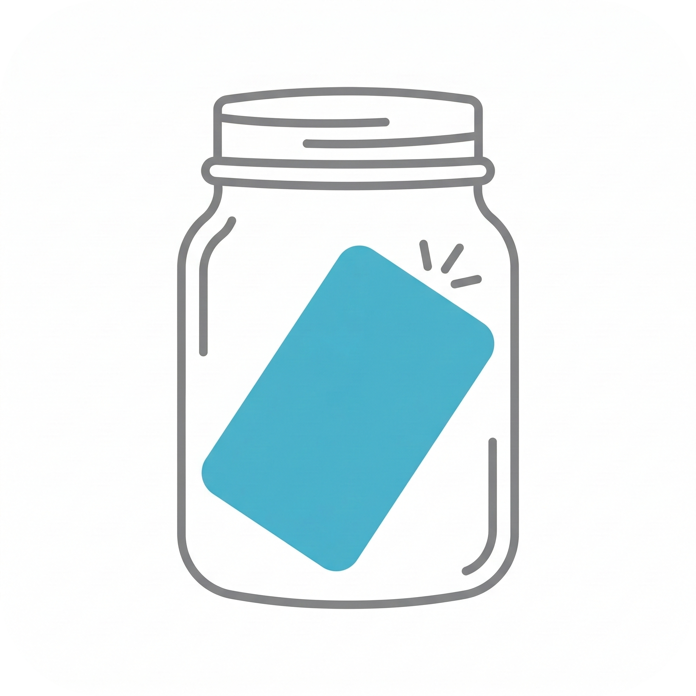

 

<h1> Your pocket-sized, AI-powered business card organizer

 
 

### ✨ About

Card Jar is an AI-powered business card scanner built on a "Bring Your Own Key" (BYOK) model. Simply snap a photo to extract details, save everything locally on your phone for privacy, and get one-tap shortcuts to call, email, or WhatsApp your contacts.

 

## 🚀 Features

| Feature | Description |
|---|---|
| 🧠 **AI Card Scanner** | Instantly extract contact details from card photos. |
| 🔑 **BYOK Model** | Add your own API key to power the AI extractions. |
| 📱 **Local Storage** | All scanned cards are saved securely and offline on your device. |
| ⚡ **Quick Actions** | One-tap shortcuts to Call, WhatsApp, Email, or open Maps. |
| 📝 **Manual Edit** | Add new cards by hand or edit scanned details easily. |

 

### 🌐 Connect With Me

 

### 📸 Screenshots

 

